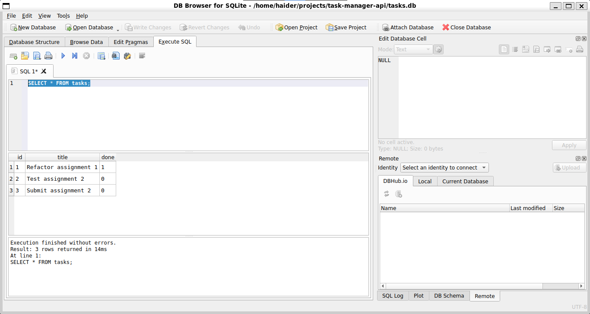
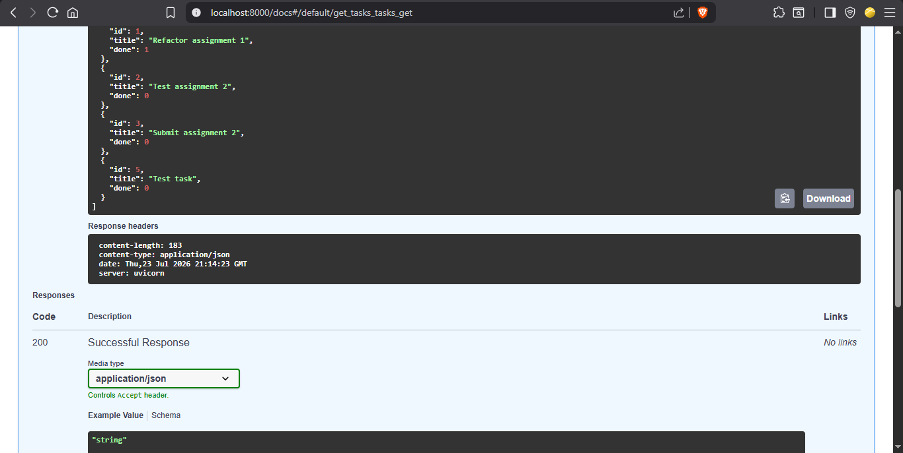

# Task Manager API


A minimal FastAPI backend with a full CRUD API for managing tasks, now with **persistent SQLite storage**. Built for the FlyRank Backend AI Engineering track – demonstrates separation of concerns (layered architecture) and professional Python project structure.

## Tech Stack

- **Python** 3.14+
- **FastAPI** – modern web framework
- **uv** – fast package manager
- **pytest** – testing
- **ruff** – linting + formatting
- **pre-commit** – quality gates
- **SQLite** – lightweight, serverless database

## Setup

```bash
# Clone the repository
git clone https://github.com/SHaiderM16/task-manager-api.git
cd task-manager-api

# Switch to the branch for this assignment
git checkout a2-sqlite

# Install dependencies
uv sync
```

## Run

```bash
# Development server with auto-reload
uv run fastapi dev app/main.py

# Production server
uv run fastapi run app/main.py
```

## API Endpoints

| Method | Endpoint | Description | Status Codes |
|--------|----------|-------------|--------------|
| GET | `/` | Root message | 200 |
| GET | `/tasks` | List all tasks | 200 |
| GET | `/tasks/{id}` | Get a single task | 200, 404 |
| POST | `/tasks` | Create a new task | 201, 400 |
| PUT | `/tasks/{id}` | Update a task | 200, 400, 404 |
| DELETE | `/tasks/{id}` | Delete a task | 204, 404 |

## Testing with curl

Create a new task:

```bash
curl -i -X POST http://localhost:8000/tasks \
  -H "Content-Type: application/json" \
  -d '{"title": "Test task"}'
```

Expected response:

```
HTTP/1.1 201 Created
date: Thu, 23 Jul 2026 21:12:32 GMT
server: uvicorn
content-length: 41
content-type: application/json

{"id":5,"title":"Test task","done":false}
```

List all tasks:

```bash
curl -i http://localhost:8000/tasks
```

## Database

This project uses **SQLite** (`tasks.db`) for persistent storage.

- **Why SQLite?** Zero configuration, serverless, single-file database.
- **Schema:** `tasks` table with `id` (INTEGER PRIMARY KEY), `title` (TEXT), `done` (INTEGER, 0/1).
- **Auto-creation:** The database and table are created automatically on first run.
- **Seeding:** Three example tasks are inserted only when the table is empty (no duplicates on restart).

### Database Screenshot



### Manual SQL Example

Opening `tasks.db` in DB Browser and running:

```sql
SELECT * FROM tasks WHERE done = 1;
```

Returns all completed tasks.

## Swagger UI

Interactive API documentation is available at [`/docs`](http://localhost:8000/docs) when the server is running.


